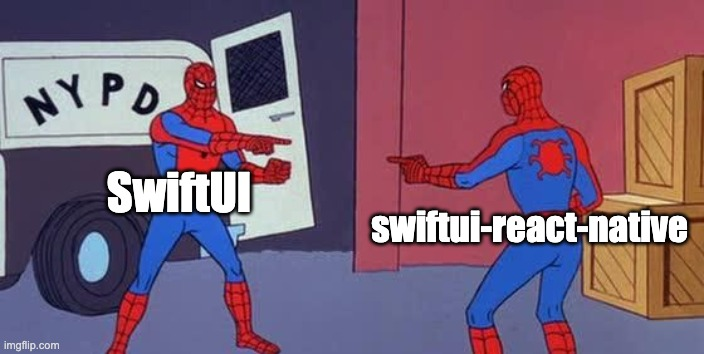

Bringing the best **SwiftUI** features to your **React Native** app :rocket:


## At a Glance

- :white_check_mark: SwiftUI-like API
- :white_check_mark: Written in TypeScript
- :white_check_mark: Animations with Reanimated v2
- :white_check_mark: Built-in dark mode

## Usage

import Tabs from '@theme/Tabs';
import TabItem from '@theme/TabItem';

<Tabs>
<TabItem value="srn" label="swiftui-react-native">

```tsx
import {
  VStack,
  Text,
  TextField,
  Button,
  useBinding,
} from 'swiftui-react-native';

function App() {
  const $text = useBinding('');
  return (
    <VStack
      aligment="leading"
      backgroundColor="systemGray6"
      padding={{ leading: 30 }}
      cornerRadius={20}
    >
      <Text font="title">Some cool text</Text>
      <TextField text={$text} placeholder="Name" />
      <Button action={doSomething}>
        <Text fontWeight="bold">Click the cool button</Text>
      </Button>
    </VStack>
  );
}
```

</TabItem>
<TabItem value="swiftui" label="SwiftUI">

```swift
import SwiftUI

struct App: View {

    @State var text = ""

    var body: some View {
        VStack(alignment: .leading) {
            Text("Some cool text")
                .font(.title)
            TextField("Name", text: $text)
            Button(action: doSomething) {
                Text("Click the cool button")
            }
        }
        .background(Color(.systemGray6))
        .padding(.leading, 30)
        .cornerRadius(20)
    }
}
```

</TabItem>
<TabItem value="react-native" label="React Native">

```tsx
import React, { useState } from 'react';
import {
  View,
  Text,
  TextInput,
  TouchableOpacity,
  StyleSheet,
} from 'react-native';

function App() {
  const [text, setText] = useState('');
  return (
    <View style={styles.container}>
      <Text style={styles.title}>Some cool text</Text>
      <TextInput
        placeholder="Name"
        value={text}
        onChangeText={(text) => setText(text)}
      />
      <TouchableOpacity onPress={doSomething}>
        <Text style={styles.buttonText}>Click the cool button</Text>
      </TouchableOpacity>
    </View>
  );
}

const styles = StyleSheet.create({
  container: {
    justifyContent: 'flex-start',
    backgroundColor: '#F2F2F7FF',
    paddingLeft: 30,
    borderRadius: 20,
  },
  title: {
    fontSize: 28,
  },
  buttonText: {
    fontWeight: 'bold',
  },
});
```

</TabItem>
</Tabs>

This meme pretty much sums it up!



## But...Why?

Recently I made the switch, both personally and professionally, to focus more on mobile development and less on the web. I started playing around with React Native and SwiftUI, and I was really impressed by how easy it was to build quality apps with them both. My experience building apps with these frameworks encouraged me to combine their strengths. SwiftUI is incredibly well designed, and using it feels like the _right_ way to build apps. This library started as an experiement to see if I could bring that same feeling to the React Native world.

## Acknowledgements

Thanks to [Zach Grimaldi](https://github.com/zpg6) for contributing awesome ideas and for bringing a much needed iOS developer's perspective to table.
